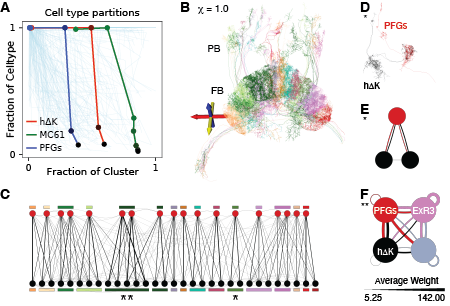
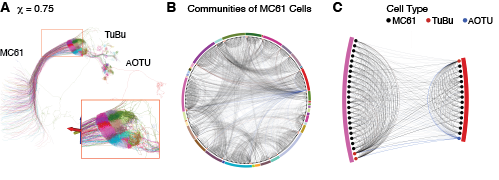

## Algorithmically-identified type-specific wiring patterns. 

**A.** For each cell type, the communities we find partition the cells of that type. This partition is summarized by the completeness and homogeneity scores (see text). As the resolution scale parameter, $\chi,$ varies, each cell type traces out a curve in the completeness (y axis) vs.\ homogeneity (x axis) plane. Shown are these curves for all cell types with at least 10 exemplars in the Hemibrain. We highlight two cell types whose curves indicate the possible presence of a repeated type-specific wiring pattern.

**B.** Clustering at $\chi = 1.0$ reveals the columnar structure of FB. Pictured are all clusters containing h$\Delta$K cells, which includes all h$\Delta$K neurons and all PFGs neurons. PFGs cells connect the protocerebral bridge (PB) to FB, while h$\Delta$K cells are local to the FB. Not shown are five cells which are part of these clusters (a left-right pair of ExR neurons and three FB neurons), but would otherwise obscure the figure.

**C.** The undirected network of h$\Delta$K neurons and PFGs neurons in these clusters. The network is roughly bipartite, with strong connections between cells of different types, but only sparse and weak connections among cells of the same type. Each cluster is composed of one or two PFGs cells and several h$\Delta$K cells. The 18 PFGs cells (top row) are ordered according to their spatial arrangement in FB.

**D.** Morphological rendering of the cells in the cluster marked *, colored by cell type.

**E.** Directed network representation of cluster marked *, with edges colored by source cell.

**F.** The cluster marked ** contains 4 additional neurons, two ExR3 neurons and two FB6A neurons. These neurons form reciprocal connections to all h$\Delta$K and PFGs cells, in all clusters. Shown here is the cell type connectivity graph of the indicated cluster. Nodes represent cell types, and edge weights are given by the average connection strength between cells of the two types. Edges are colored according to the source node.

**A.** Clustering at $\chi = 0.75$ reveals a distinct spatial tiling pattern in MC61 cells and their outputs, with each tile receiving inputs from spatially congregated input fibers from the medulla. Shown are 293 cells, comprising all clusters which are at least 80\% MC61 cells. This includes 258 of 346 MC61 cells (75\%) in the Hemibrain data set.

**B.** The neurons in **A** form a highly organized network: Each cluster of MC61 cells converges on a common TuBu cell. Two of the clusters are shown in **C**, with edges colored by the presynaptic neuron.
