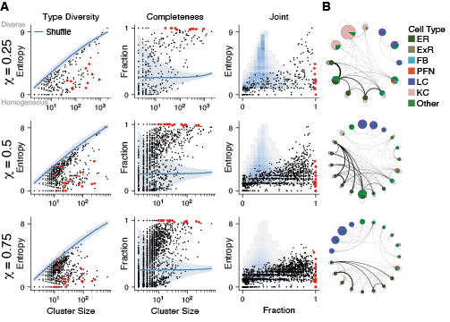

## Hemibrain Cluster Composition

Cell type composition of clusters identified by maximizing $Q_g(\chi)$. 

**A.** Heterogeneity and completeness of cell types in clusters. Each row shows clusters identified using a different value of $\chi$. The left column shows the heterogeneity (entropy) of cell type distributions within each cluster. Each black dot represents a cluster found using our method, with the corresponding cell type entropy plotted against cluster size. Large red dots indicate clusters shown in networks in panel~\textbf{B.} The blue line shows the average entropy of clusters in the shuffled data ($n=100$ shuffles), with the band indicating 3 standard deviations about the mean. The middle column shows cell type completion within each cluster. The right column shows  heterogeneity against completeness for the same data; black dots correspond to the actual data, shaded squares show a 2D histogram obtained from shuffled data. 

**B.** Reduced networks of clusters with at least 97\% cell type completion and at least 10 neurons. Node size is proportional to the number of neurons in the cluster. At different resolutions, ER cells and LC cells remain completely clustered
