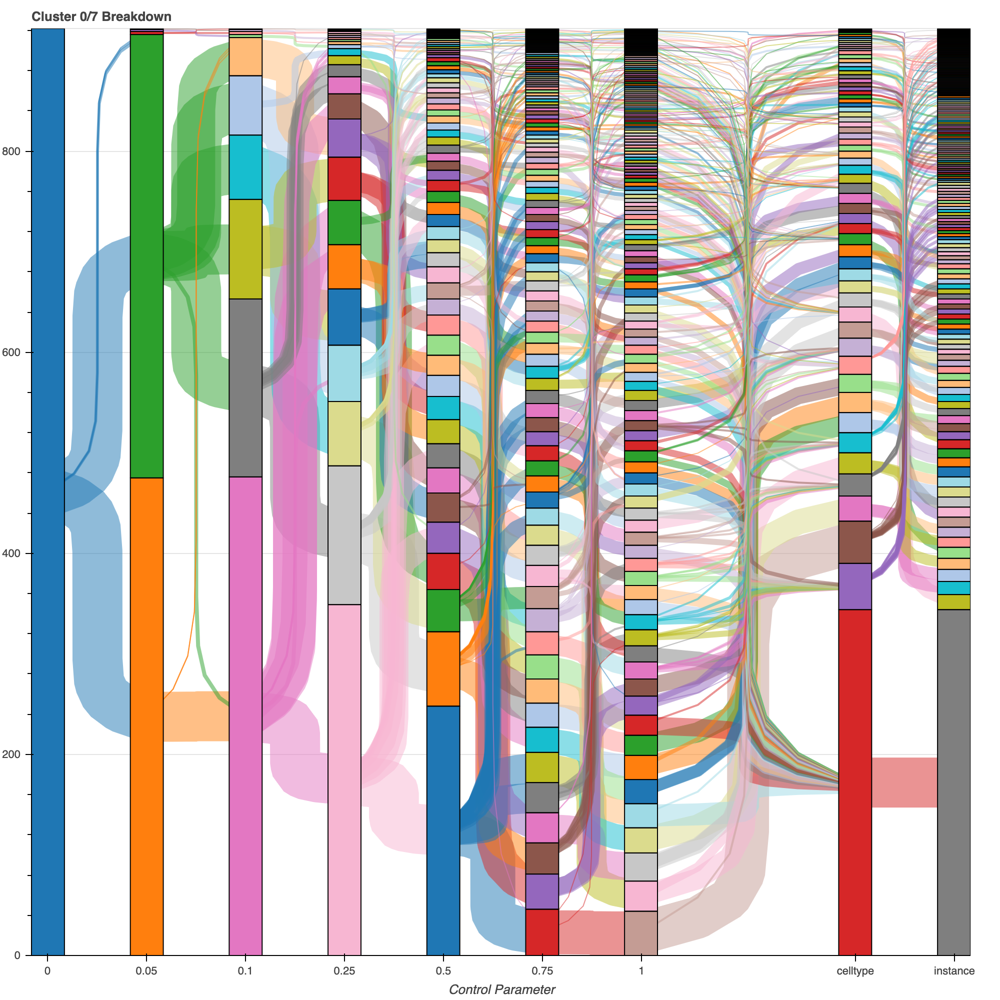

# Gallery

## Reduced Graphs

We use a clustering algorithm with a control parameter which essentially controls the coarseness of the clustering -- lower values of the parameter produce larger clusters, which tend to break apart into smaller sub-clusters as the parameter increases. Below is an example of the output from this algorithm. The left plot shows the 8 clusters found at the coarsest setting, with the control parameter at 0 -- each node in this graph represents from just under 100 to over 5000 neurons; the edges are log scaled to the number of edges between the clusters. A slight increase in the control parameter breaks apart those clusters, shown on the right. Click on the plots for interactive versions: hover over a node to see how many nodes and edges lie within that cluster, as well as highlight its connectivity. The toolbar on the right lets you pan and zoom as well.

## Cluster breakdown

Below is an example of how a single cluster breaks apart as the control parameter increases. The leftmost bar shows about 900 cells grouped together at the coarsest scale (control parameter = 0),
in cluster #7 (the cluster labels are arbitrary). We'll refer to clusters by "parameter/id", so this cluster is "0.0/7".
As the parameter increases (x axis), the clusters break apart. The height of each block is the proportion of the original ~900 cells
that group together at the new parameter value.
The white margins indicate cells from the rest of the network that are part of the new cluster. So, for example,
when the parameter increase from 0 to 0.05, the original cluster of 900 breaks into two large subclusters (plus a few tiny clusters).
The orange cluster (cluster 0.05/9) consists of 475 cells, all of which were part of cluster 0.0/7.
On the other hand, the green block represents only 441 out of 559 cells in cluster 0.05/7, hence the white margins indicating that 118 cells, or about 20%
of this cluster, does not belong to the original cluster 0.0/7.
Looking from left to right, most of the bars are fully shaded -- the take away is, the clustering algorithm finds finer community structure as the control parameter increases.

  

The other noteworthy feature of this plot is the last two columns. "Celltype" is the expert-labeled cell type information annotated by neuroscientists.
Notice that almost all of the blocks are completely shaded -- that is, this clustering algorithm (which only has access to weighted connectivity information)
groups together many cell types.

Clicking the figures below will take you to interactive plots made using the `bokeh` package in Python.
They contain the same information as above, in the form of a flowchart, to show how the blocks are interrelated.
(If the links are taking you to raw html instead of interactive plots, view this page [on github pages](https://josiclab.github.io/flybrain-clustering/gallery.html)). Click on a block to highlight the incoming and outgoing edges; the control panel on the right of the plot
allows you to zoom using a zoom box or the scroll wheel of your mouse.

The top left figure is the breakdown of cluster 0.0/7, from left to right.
The top right and bottom left figures show clusters 0.05/9 and 0.05/7, respectively.
The bottom right figure shows cells of type MC61 (notice the rightmost columns are one color).

## Connectivity-based cell type

Beyond simply grouping related neurons together, this clustering seems to reveal connectivity properties of cell types. By reducing the connections of individual neurons to their connectivity to the clusters found by the algorithm, we turn a 20,000 x 20,000 connectivity matrix into a 20,000 x 2 _k_ matrix, where _k_ is the number of clusters. Each row corresponds to a single neuron, and the 2 _k_ columns are its pre- and post-synaptic contacts in the _k_ clusters. Below we show two pieces of this matrix with the _k_ = 8 clusters found with a control parameter of 0. The left figure shows the 88 cells in cluster 8, just to to illustrate what this matrix looks like. The right figure shows 922 cells, the same as shown in the figures above. The right figure is difficult to read -- click on it to go to an interactive version, with tooltips and the ability to zoom in, to see specific cell IDs (which are otherwise rather jumbled on the left side).

